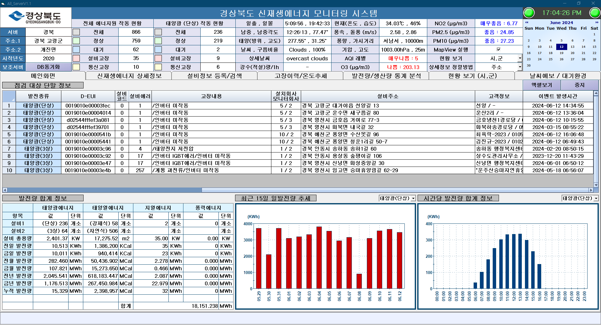
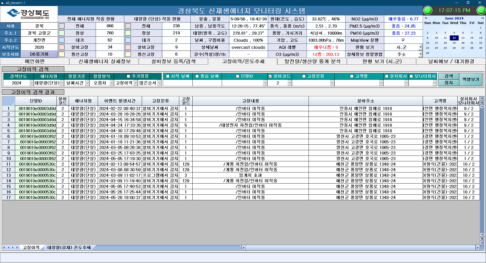

# theREMS db 구조 설계


## 8. Energy


### Energy 1 : 태양광 단상


``` javascript
GET /v2/energy/solarlight/single
```


``` json
{
  "aEpIndex": "숫자", // id O
  "aEui": "문자", // equipment(id) 에 대응되는 device TABLE의 device(id) -> device_lora(device_eui) O
  "aEpCode": "숫자", // 설비코드 ?
  "aCapacity": "숫자", // O


  "aEpArea": "문자", // 도,광역시 . address(parent_id) O
  "aEpAddr1": "문자", // 시,군 . address(parent_id) O
  "aEpAddr2": "문자", // 읍,면,동. address() O-> 분리 필요
  "aEpAddr3": "문자", // 상세 주소  O-> 분리 필요


  "aEpCompany": "string", // 설치회사 이름 O
  "aRTUCompany": "string", // 모니터링 회사  O


  "aModelName": "문자", //  O
  "aEpFirstDate": "날짜/시간",  // ? 설치 시간 없음


  "aCustomer": "문자", // O
  "aCmTel": "문자", // O


  "aLastRecTime": "날짜/시간", // 수신 시간
  "aRecNum": "숫자", // 데이터 수신 횟수
  "aEpErr": "숫자",  // 설비에러코드
  "aPgErr": "숫자", // 점검에러코드


  "alongitude": "숫자", //O
  "aLatitude": "숫자", // O
  "aAzimuth": "숫자", // O
  "aTilt": "숫자", // O


  "aToday": "숫자", // 금일발전량
  "aTotal": "숫자", // 누적발전량


  "aPV_Volt": "숫자", // PV 전압(V)
  "aPV_Amp": "숫자", // PV전류(A)
  "aPV_PW": "숫자", // PV 출력(W)
  "aOut_Volt": "숫자", // 출력 전압(V)
  "aOut_Amp": "숫자", // 출력 전류(A)
  "aOut_PW": "숫자", // 현재 출력(W)
  "aPfactor": "숫자", // 역률(%), data 10배
  "aFrequency": "숫자", // 주파수(Hz), data 10배


  "aLossArea": "숫자", // 난청지역 false, true 값이며 lora가 수신되지 않는 음영지역이면 true(1)을 사용자가 입력하도록 하며, 특별한 입력이 없다면기본값은 0이 되도록 한다.


  "aEpErrDate": "날짜/시간", // 최초 설비에러코드가 발생한 시간이다.(프로그램에서 계산 필요하며, 글로 정리하기에는 복잡하기 때문에 일단 필드만 만들어두고 천천히 설명듣고 구현)
  "aErrTotal": "숫자", // 임계치초과 혹은 누적발전량감소, 5일이상발전량 변화가 없을 때에 기록하는 누적발전량값
  "aN_ErrDate": "날짜/시간", // 데이터가 통신에러가 없는 날짜시간(프로그램에서 계산 필요하며, thingplug로 부터 누적값과 계측값이 포함되어 있는 데이터가 왔을 때의 시간이며 설비에러코드와는 상관없다.)
  "aChangeVal": "숫자", // 인버터 교체에 대비한 보정값이다. 음수값이 올수도 있다. 이 개념은 설명이 필요하다.
  "aCommErr": "숫자", // 에너지원 기기(인버터나 제어기)와 rtu와의통신에러
  "aStdVal": "숫자" // 금일발전량을 구하기위한 기준값. 간소화를 위하여 논의 필요. 금일 최초 받은 누적값 기입하고 밤12시에는 0으로 리셋해서저장 해 둠.
}
```


### Energy 2 : 태양광 3상


``` javascript
GET /v2/energy/solarlight/three
```


``` json
{
  "aEpIndex": "숫자", // id O
  "aEui": "문자", // equipment(id) 에 대응되는 device TABLE의 device(id) -> device_lora(device_eui) O
  "aEpCode": "숫자", // 설비코드 ?
  "aCapacity": "숫자", // O


  "aEpArea": "문자", // 도,광역시 . address(parent_id) O
  "aEpAddr1": "문자", // 시,군 . address(parent_id) O
  "aEpAddr2": "문자", // 읍,면,동. address() O-> 분리 필요
  "aEpAddr3": "문자", // 상세 주소  O-> 분리 필요


  "aEpCompany": "문자", // 설치회사 이름 O
  "aRTUCompany": "string", // 모니터링 회사  O


  "aModelName": "문자", //  O
  "aEpFirstDate": "날짜/시간",  // ? 설치 시간 없음


  "aCustomer": "문자", // O
  "aCmTel": "문자", // O


  "aLastRecTime": "날짜/시간", // 수신 시간
  "aRecNum": "숫자", // 데이터 수신 횟수
  "aEpErr": "숫자",  // 설비에러코드
  "aPgErr": "숫자", // 점검에러코드


  "alongitude": "숫자", //O
  "aLatitude": "숫자", // O
  "aAzimuth": "숫자", // O
  "aTilt": "숫자", // O


  "aToday": "숫자", // 금일발전량
  "aTotal": "숫자", // 누적발전량


  "aPV_AvgVolt": "숫자", // PV 전압(V)(평균)
  "aPV_TotalAmp": "숫자", // PV전류(A)(합)
  "aPV_PW": "숫자", // PV 출력(W)
  "aRS_Volt": "숫자", // 계통 R상 (RS 선간) 전압(V)
  "aST_Volt": "숫자", // 계통 S상 (ST 선간) 전압(V)
  "aTR_Volt": "숫자", // 계통 S상 (ST 선간) 전압(V)
  "aRS_Amp": "숫자", // 계통 R상 전류(A)
  "aST_Amp": "숫자", // 계통 S상 전류(A)
  "aTR_Amp": "숫자", // 계통 T상 전류(A)
  "aOut_PW": "숫자", // 현재출력(W)
  "aPfactor": "숫자", // 역률(%), data 10배
  "aFrequency": "숫자", // 주파수(Hz), data 10배
  "aLossArea": "숫자", // 난청지역 false, true 값이며 lora가 수신되지 않는 음영지역이면 true(1)을 사용자가 입력하도록 하며, 특별한 입력이 없다면기본값은 0이 되도록 한다.


  "aEpErrDate": "날짜/시간", // 최초 설비에러코드가 발생한 시간이다.(프로그램에서 계산 필요하며, 글로 정리하기에는 복잡하기 때문에 일단 필드만 만들어두고 천천히 설명듣고 구현)
  "aErrTotal": "숫자", // 임계치초과 혹은 누적발전량감소, 5일이상발전량 변화가 없을 때에 기록하는 누적발전량값
  "aN_ErrDate": "날짜/시간", // 데이터가 통신에러가 없는 날짜시간(프로그램에서 계산 필요하며, thingplug로 부터 누적값과 계측값이 포함되어 있는 데이터가 왔을 때의 시간이며 설비에러코드와는 상관없다.)
  "aChangeVal": "숫자", // 인버터 교체에 대비한 보정값이다. 음수값이 올수도 있다. 이 개념은 설명이 필요하다.
  "aCommErr": "숫자", // 에너지원 기기(인버터나 제어기)와 rtu와의통신에러
  "aStdVal": "숫자" // 금일발전량을 구하기위한 기준값. 간소화를 위하여 논의 필요. 금일 최초 받은 누적값 기입하고 밤12시에는 0으로 리셋해서저장 해 둠.
}
```


### Energy 3 : 태양열 강제식


``` javascript
GET /v2/energy/solarheat/forced
```


``` json
{
  "aEpIndex": "숫자", // id O
  "aEui": "문자", // equipment(id) 에 대응되는 device TABLE의 device(id) -> device_lora(device_eui) O
  "aEpCode": "숫자", // 설비코드 ?
  "aCapacity": "숫자", // O
  "aEpArea": "문자", // 도,광역시 . address(parent_id) O
  "aEpAddr1": "문자", // 시,군 . address(parent_id) O
  "aEpAddr2": "문자", // 읍,면,동. address() O-> 분리 필요
  "aEpAddr3": "문자", // 상세 주소  O-> 분리 필요
  "aEpCompany": "string", // 설치회사 이름 O
  "aRTUCompany": "string", // 모니터링 회사  O
  "aModelName": "문자", //  O
  "aEpFirstDate": "날짜/시간",  // ? 설치 시간 없음
  "aCustomer": "문자", // O
  "aCmTel": "문자", // O
  "aLastRecTime": "날짜/시간", // 수신 시간
  "aRecNum": "숫자", // 데이터 수신 횟수
  "aEpErr": "숫자",  // 설비에러코드
  "aPgErr": "숫자", // 점검에러코드
  "alongitude": "숫자", //O
  "aLatitude": "숫자", // O


  "aCalorie_M": "숫자", // O


  "aToday": "숫자", // 금일발전량
  "aTotal": "숫자", // 누적발전량


  "aIn_Temp": "숫자", // 집열기 입구온도 data 10배
  "aOut_Temp": "숫자", // 집열기 출구온도 data 10배
  "aTop_Temp": "숫자", // 축열조 상부온도 data 10배
  "aBottom_Temp": "숫자", // 축열조 하부온도 data 10배
  "aFlux": "숫자", // 유량값 단위 l/min data 10배
  "aPipe1_Temp": "숫자", // 급수배관온도 data 10배
  "aPipe2_Temp": "숫자", // 급탕배관온도 data 10배
  "aUse_Flux": "숫자", //소비유량값 data 10배
  "aUse_Total": "숫자", // 누적사용량 Kcal data 100배


  "aLossArea": "숫자", // 난청지역 false, true 값이며 lora가 수신되지 않는 음영지역이면 true(1)을 사용자가 입력하도록 하며, 특별한 입력이 없다면기본값은 0이 되도록 한다.


  "aEpErrDate": "날짜/시간", // 최초 설비에러코드가 발생한 시간이다.(프로그램에서 계산 필요하며, 글로 정리하기에는 복잡하기 때문에 일단 필드만 만들어두고 천천히 설명듣고 구현)
  "aErrTotal": "숫자", // 임계치초과 혹은 누적발전량감소, 5일이상발전량 변화가 없을 때에 기록하는 누적발전량값
  "aN_ErrDate": "날짜/시간", // 데이터가 통신에러가 없는 날짜시간(프로그램에서 계산 필요하며, thingplug로 부터 누적값과 계측값이 포함되어 있는 데이터가 왔을 때의 시간이며 설비에러코드와는 상관없다.)
  "aChangeVal": "숫자", // 인버터 교체에 대비한 보정값이다. 음수값이 올수도 있다. 이 개념은 설명이 필요하다.
  "aCommErr": "숫자", // 에너지원 기기(인버터나 제어기)와 rtu와의통신에러
  "aStdVal": "숫자" // 금일발전량을 구하기위한 기준값. 간소화를 위하여 논의 필요. 금일 최초 받은 누적값 기입하고 밤12시에는 0으로 리셋해서저장 해 둠.
}
```


### Energy 4 : 태양열 자연순환식


``` javascript
GET /v2/energy/solarlight/single
```


``` json


```


# 신재생 에너지 추가개발 API 목록


## 대시보드


- 전체에너지원 작동 현황
- 태양광 작동 현황
- 날씨


## 메인화면



- 점검대상 단말 정보
- 발전량 합계 정보


### 점검대상 단말 정보
✓ 발전종류 , D-EUI , 설비코드 , 설비에러 , 고장내용 , 설치회사 , 모니터 회사 , 설비주소 , 고객명 , 고객전화번호 , 이벤트 발생시간


```javascript
GET /v2/equipment/inspection
```


<details>
<summary><span style="color:blue; background-color:white">200</span></summary>
<div markdown="1">
<div>


```json
{
    "inspection_equiments": [
        {
            "equipmentType": "string", // 발전종류
            "aEui": "string", // D-EUI
            "aEpCode": "number", // 설비코드
            "aPgErr": "number", // 설비에러
            "고장내용": "string", // 고장내용
            "aEpCompany": "string", // 설치회사
            "aRTUCompany": "string", // 모니터회사
            "aEpArea": "string", // 설비주소
            "aEpAddr1": "string",
            "aEpAddr2": "string",
            "aEpAddr3": "string",
            "aCustomer": "string", // 고객명
            "aCmTel": "string", // 고객전화번호
            "aEpErrDate": "datetime" // 이벤트 발생 시간
        }
    ]
}
```


</div>
</div>
</details>


### 발전량 합계 정보
✓ 태양광에너지(단상/3상) , 태양열에너지(강제식/자연식) , 지열 , 풍력


✓ 설비 총용량,


✓ 전일 , 금일 , 전월 , 금월, 전년, 금년 , 누적 발전량


✓ 최근 15일 일발전량 추세, 시간당 발전량 합계 정보


```javascript
GET /v2/record/power/total
```


<details>
<summary><span style="color:blue; background-color:white">200</span></summary>
<div markdown="1">
<div>


```json
{
"발전량합계정보": [
{
"태양광에너지(energy1+2)": {
"count1": "number", // 설치현황(개소)
"count2": "number",
"tCapacity": "number", // 설비 총룡량(KW)
"tYesterday": "number", // 전일 발전량(KWh)
"tToday": "number", // 금일 발전량(KWh)
"tPreMonth": "number", // 전월 발전량(MWh)
"tCurMonth": "number", // 금월 발전량(MWh)
"tPreYear": "number", // 전년 발전량(MWh)
"tCurYear": "number", // 금년 발전량(MWh)
"tTotal": "number" // 누적 발전량(MWh)
}
},
{
"태양열에너지(energy3+4)": {
"count1": "number",
"count2": "number",
"tCapacity": "number",
"tYesterday": "number",
"tToday": "number",
"tPreMonth": "number",
"tCurMonth": "number",
"tPreYear": "number",
"tCurYear": "number",
"tTotal": "number"
}
},
{
"지열에너지(energy5)": {
"count1": "number",
"count2": "number",
"tCapacity": "number",
"tYesterday": "number",
"tToday": "number",
"tPreMonth": "number",
"tCurMonth": "number",
"tPreYear": "number",
"tCurYear": "number",
"tTotal": "number"
}
},
{
"풍력에너지(energy6)": {
"count1": "number",
"count2": "number",
"tCapacity": "number",
"tYesterday": "number",
"tToday": "number",
"tPreMonth": "number",
"tCurMonth": "number",
"tPreYear": "number",
"tCurYear": "number",
"tTotal": "number"
}
},
{
"sumtTotal(합계)": "number" // 합계
}
]
}
```


</div>
</div>
</details>


## 신재생에너지 상세정보


### 태양광(단상, 3상)
✓ D-EUI , 설비코드 , 설비주소(도,시,동,상세) , 고객정보 , 설치회사/모니터회사 , 수신시간 , 수신횟수 , 난청지역 , 최초설비가동날짜 , 설비용량 , 설비에러 , 점검에러 , 통신에러 , 패널입사각 , 전일발전량 , 금일발전량 , 누적발전량 , PV전압 , PV출력 , 출력전압 , 출력전류 , 현재출력 , 역률 , 주파수 , 일출 , 남중 , 일몰 , 패널방위각 , 패널경사각 , 설치경도 , 설치위도 , 최초설비에러 발생시간 , 누적발전량 오류값 , 누적발전량 수신시간 , 누적발전량보정값 , 금일기준값


```javascript
GET /v2/equipment/{equipment-type}
```


<details>
<summary><span style="color:blue; background-color:white">200</span></summary>
<div markdown="1">
<div>


```json
{
"energy1(태양광(단상))": [
{
"aEui": "string", // D-EUI
"aEpCode": "number", // 설비코드
"설비주소": { // 설비 주소
"aEpArea": "string",
"aEpAddr1": "string",
"aEpAddr2": "string",
"aEpAddr3": "string"
},
"고객정보(고객명/고객전화번호)": {
"aCustomer": "string", // 고객명
"aCmTel": "string" // 고객 전화번호
},
"설치회사/모니터회사": {
"EpComCode": "number", // 설치회사
"RTUComCode": "number" // 모니터회사
},
"aLastRecTime": "datetime", // 수신시간
"aRecNum": "number", // 수신횟수
"aLossArea": "number(bool)", // 난청지역


"aEpFirstDate": "date", // 최초설비가동날짜
"aCapacity": "number", // 설비용량
"aEpErr": "number(bool)", // 설비에러
"점검에러": "number(bool)", // 점검에러
"aCommErr": "number(bool)", // 통신에러
"패널입사각": "number", // 패널입사각
"aYesterday": "number", // 전일발전량
"aToday": "number", // 금일발전량
"aTotal": "number", // 누적발전량
"aPV_Volt": "number", // PV전압
"aPV_PW": "number", // PV출력
"aOut_Volt": "number", // 출력전압
"aOut_Amp": "number", // 출력전류
"aOut_PW": "number", // 현재출력
"aPfactor": "number", // 역률
"aFrequency": "number", // 주파수
"sunrise": "time", // 일출 시간
"noon": "time", // 남중 시간
"sunset": "time", // 일몰 시간
"aAzimuth": "number", // 패널방위각
"aTilt": "number", // 패널경사각
"alongitude": "number", // 설치경도
"aLatitude": "number", // 설치위도
"aEpErrDate": "datetime", // 최초설비에러 발생시간
"aErrTotal": "number", // 누적발전량 오류값
"aN_ErrDate": "datetime", // 누적발전량 수신시간
"aChangeVal": "number", // 누적발전량보정값
"aStdVal": "number" // 금일기준값
}
],
"energy2(태양광(3상))": [
{
"aEui": "string",
"aEpCode": "number",
"설비주소": {
"aEpArea": "string",
"aEpAddr1": "string",
"aEpAddr2": "string",
"aEpAddr3": "string"
},
"고객정보(고객명/고객전화번호)": {
"aCustomer": "string",
"aCmTel": "string"
},
"설치회사/모니터회사": {
"EpComCode": "number",
"RTUComCode": "number"
},
"aLastRecTime": "datetime",
"aRecNum": "number",
"aLossArea": "number(bool)",


"aEpFirstDate": "date",
"aCapacity": "number",
"aEpErr": "number(bool)",
"점검에러": "number(bool)",
"aCommErr": "number(bool)",
"패널입사각": "number",
"aYesterday": "number",
"aToday": "number",
"aTotal": "number",
"aPV_Volt": "number",
"aPV_PW": "number",
"aOut_Volt": "number",
"aOut_Amp": "number",
"aOut_PW": "number",
"aPfactor": "number",
"aFrequency": "number",
"sunrise": "time",
"noon": "time",
"sunset": "time",
"aAzimuth": "number",
"aTilt": "number",
"alongitude": "number",
"aLatitude": "number",
"aEpErrDate": "datetime",
"aErrTotal": "number",
"aN_ErrDate": "datetime",
"aChangeVal": "number",
"aStdVal": "number"
}
]
}
```


</div>
</div>
</details>


## 설비정보 등록/검색


- 설비정보 등록/검색
- 설비정보 검색 결과
- 설치업체 등록
- 모니터업체 등록
- 지자체 등록


### 설비정보 등록/검색
✓ 에너지원, 단말ID, 코드, 용량, (도), (시,군) ,(읍,면,동), (이하상세), 고객명, 발전량보정, 설치회사, 모니터회사


```javascript
GET /v2/equipment/{id}
```


<details>
<summary><span style="color:blue; background-color:white">200</span></summary>
<div markdown="1">
<div>


```json
{
"filter": {
"equipment_type": "string" // 에너지원
},


"option": {
"aEui": "string", // 단말ID
"aEpCode": "number", // 코드
"aCapacity": "number", // 용량
"설비주소": { // 설비주소
"aEpArea": "string",
"aEpAddr1": "string",
"aEpAddr2": "string",
"aEpAddr3": "string"
},
"aCustomer": "string", // 고객명
"발전량보정": "bool", // 발전량보정
"EpComCode": "string", // 설치회사
"RTUComCode": "string" // 모니터회사
}
}


```


</div>
</div>
</details>


### 설비정보 검색 결과
✓ 단말ID, 에너지원, 설비코드, 설비용량, 설비주소, 설치회사/모니터회사, 설비 모델명, 최초설비가동날짜, 고객명, 전화번호, 설치경도, 설치위도, 패널방위각, 패널경사각, 난청지역, 단말 인덱스, 누적발전량 생성시간, 누적발전량 입력값, 단말ID/설비코드 변경, 누적발전량 보정값, 구독ID, IP:포트, 결과 Code


```javascript
GET /v2/equipment/{id}
```


<details>
<summary><span style="color:blue; background-color:white">200</span></summary>
<div markdown="1">
<div>


```json
{
"aEui": "string", // 단말ID
"equipment_type": "string", // 에너지원
"aEpCode": "number", // 설비코드
"aCapacity": "number", // 설비용량
"aEpArea": "string", // 설비주소
"aEpAddr1": "string",
"aEpAddr2": "string",
"aEpAddr3": "string",
"설치회사/모니터회사": {
"EpComCode": "number", // 설치회사
"RTUComCode": "number" // 모니터회사
},
"aModelName": "string", // 설비 모델명
"aEpFirstDate": "date", // 최초설비가동날짜
"aCustomer": "string", // 고객명
"aCmTel": "string", // 전화번호
"alongitude": "number", // 설치경도
"aLatitude": "number", // 설치위도
"aAzimuth": "number", // 패널방위각
"aTilt": "number", // 패널경사각
"aLossArea": "number(bool)", // 난청지역
"aEpIndex": "number", // 단말 인덱스
"aN_ErrDate": "datetime", // 누적발전량 생성시간
"aTotal": "number", // 누적발전량 입력값
"edit": {
"aEui, aEpCode 변경": "string", // 단말ID/설비코드 변경
"aTotal 보정값": "number" // 누적발전량 보정값
},
"구독ID": "string", // 구독ID
"IP:포트": "string", // IP:포트
"결과Code": "number" // 결과 Code
}


```


</div>
</div>
</details>


### 설치업체 등록
✓ 설치 업체명, 업체 코드, 전화번호


### 모니터업체 등록
✓ 모니터 업체명, 업체 코드, 전화번호


### 지자체 등록
✓ 지자체명, 구분, 전화번호


## 고장이력 / 온도추세



- 고장이력 검색
- 고장이력 검색 결과
- 태양열(강제) 온도추세


### 고장이력 검색 / 결과
✓ 검색년도, 에너지원, 정렬기준, 정렬방식, 추가정렬, 시작날짜, 종료날짜, 단말ID, 설비코드, 고장분류, 고객명, 설치회사, 모니터회사


```javascript
GET /v2/equipment/inspection
```
<!--
<details>
<summary><span style="color:blue; background-color:white">200</span></summary>
<div markdown="1">
<div>
-->


```json
{


}


```
<!--
</div>
</div>
</details>
-->

